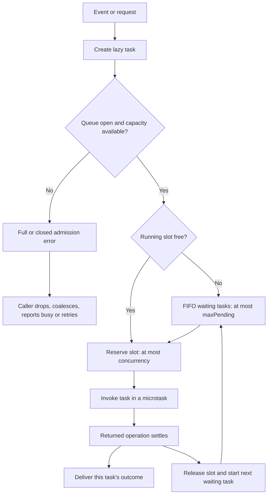
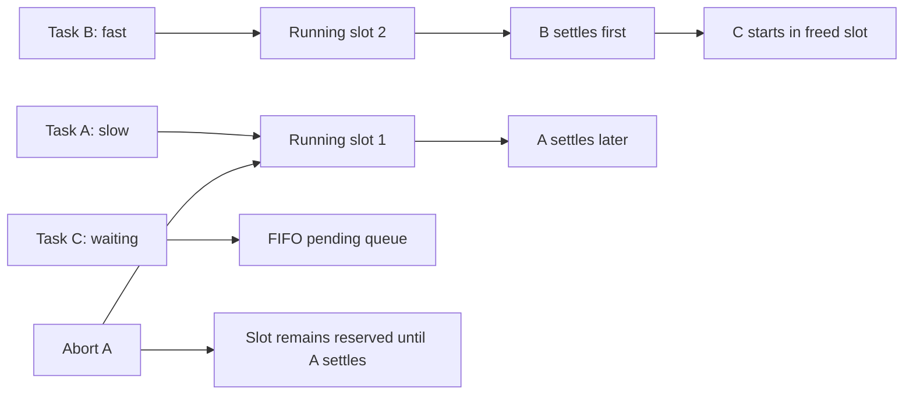
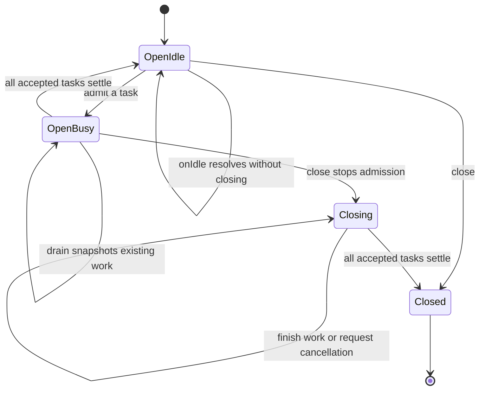

[](https://www.npmjs.com/package/@shutterstock/p-map-iterable) [](https://opensource.org/licenses/MIT) [](https://github.com/shutterstock/p-map-iterable/actions/workflows/ci.yml)

# p-map-iterable

Control asynchronous I/O concurrency and backpressure for iterable pipelines and event-driven work.

This branch introduces the **2.x TaskQueue API**. The npm badge and [published API documentation](https://tech.shutterstock.com/p-map-iterable/) may describe the latest 1.x release until 2.x ships. See [2.x design and migration](DESIGN-2.md) and the [project review](REVIEW-2.md). Existing iterable interfaces remain exported.

Use these classes for concurrent metadata lookups, capability probes, background status checks, or read/write pipelines. The [optional aliases](#optional-names-for-concurrent-work) `ConcurrentMapper`, `MappingQueue`, and `WorkerQueue` describe the input and result contracts without tying the work to a particular I/O operation.

## Choose an interface

| Workload | Interface | Input / completion | Backpressure |
| --- | --- | --- | --- |
| Clicks, IPC requests, visible rows, independent operations | `TaskQueue` | Lazy task / per-task outcome or value promise | Hard admission bound; explicit overload; cooperative capacity wait |
| Prefetch a collection or async source | `IterableMapper` | Iterable + mapper / async iterable results | `maxUnread` slows production when results are unread |
| Push values into a pipeline with consumed results | `IterableQueueMapper` | `enqueue(value)` / async iterable results | Await admission and consume results concurrently |
| Existing batch code that discards results | `IterableQueueMapperSimple` | `enqueue(value)` / mutable `errors` array | Await each enqueue; `onIdle()` permanently closes this legacy interface |

`TaskQueue` bounds **waiting tasks**. Iterable classes apply backpressure to **unread results**. Calling legacy `enqueue()` repeatedly without awaiting it can retain unlimited input even with a finite `maxUnread`.

## Installation and module support (2.x)

Node.js 22 and newer are supported; the package is tested with Node.js 22, 24, and 26.
TaskQueue uses standard `AbortController` / `AbortSignal` and adds no runtime
dependency. Run `pnpm install --frozen-lockfile` before this branch's local examples.

```sh
npm install @shutterstock/p-map-iterable
```

CommonJS applications can use the existing API:

```js
const { IterableMapper } = require('@shutterstock/p-map-iterable');
```

ES module applications can use native named imports:

```js
import { IterableMapper } from '@shutterstock/p-map-iterable';
```

The native ESM entrypoint forwards to the canonical CommonJS implementation so both loaders
share the same class constructors, including when used together in one process.
The ESM default export is also the CommonJS API object. The package exports its
root API and `@shutterstock/p-map-iterable/package.json`; internal `dist/` paths
are private in 2.x. TypeScript receives a CommonJS `.d.ts` or ESM `.d.mts`
entrypoint through conditional exports. Use a matching Node module mode
(`node16`, `node18`, `node20`, or `nodenext`, as supported by your compiler), or
`module: "esnext"` with `moduleResolution: "bundler"` for bundler applications.

With `stopOnMapperError: false`, 2.x throws Node's native `AggregateError` after
the input has finished. Access the original rejection values through
`error.errors`, retaining `Error` identities and primitive values. In 1.x, the
`aggregate-error` dependency normalized primitives and plain objects to `Error`
instances and made the aggregate iterable. Native aggregates are not iterable;
replace iteration over the aggregate with iteration over `error.errors`. The
aggregate message is now `One or more mapper operations failed`; rejection values
are never coerced to strings. Inspect `error.errors` for individual messages and
stacks. The default `stopOnMapperError: true` behavior continues to throw the first
mapper rejection.

`pnpm run test:package` creates one real `npm pack` tarball and installs it into
separate CommonJS and ESM consumer apps with npm. The fixtures install independently of the pnpm development workspace. It checks the packed file list, strict
TypeScript resolution and runtime behavior in the compiler's supported Node
module modes, ESM bundler resolution, and mixed-loader API identity. The
matrix also uses a Node-only profile with `lib: ["es2021"]`, `types: ["node"]`,
and fixture-local Node 22 typings, verifying that no DOM declarations are loaded.
Use Node 24 for the development toolchain. By default, the consumer runtime uses
the same Node executable as the package-test script. To check an older supported
runtime, including the Node 22.0 minimum, set `PACKAGE_TEST_NODE` to that Node
binary while keeping Node 24 on `PATH`:

```sh
PACKAGE_TEST_NODE=/path/to/node-v22.0.0/bin/node pnpm run test:package
```

Only emitted consumer apps and the mixed-loader runtime probe use this override.
npm, installs, `prepack`, builds, and TypeScript compilation still use the
toolchain Node. `PACKAGE_TEST_TSC` can optionally select a different TypeScript
compiler entrypoint. The test script reports both Node versions and the compiler
version. `prepack` always builds a clean package; tests, examples, source maps,
and build cache files are excluded.

## Event admission and concurrency

Pass a **function**. Passing an already-started promise cannot limit its work.

```typescript
import { TaskQueue } from '@shutterstock/p-map-iterable';

const queue = new TaskQueue({ concurrency: 4, maxPending: 8 });

// add() returns a value or rejects, including when admission is full/closed.
async function refreshSelectedRow(id: string) {
  return await queue.add(async (signal) => {
    const response = await fetch(`/rows/${encodeURIComponent(id)}`, { signal });
    if (!response.ok) throw new Error(`HTTP ${response.status}`);
    return await response.json();
  });
}
```

Admission is synchronous. At most `concurrency` tasks reserve running slots and at most `maxPending` tasks wait in FIFO order. With defaults, the queue owns at most **12 unfinished tasks**. `maxPending: 0` accepts only work with an available running slot. Both limits are finite safe integers; concurrency must be positive and maxPending can be zero.



A slot covers the **entire returned operation**, including response-body reads, process exit, transaction commit and cleanup. Detached work inside a task falls outside this bound. TaskQueue schedules asynchronous work on the JS event loop; it does not create CPU worker threads.

### Non-awaiting event callbacks

`submit()` returns a cancellable handle. Its `result` always resolves to a discriminated outcome, so an ignored task failure cannot create an unhandled rejection. Admission errors throw synchronously: the emitter cannot await backpressure, so select an overload policy explicitly.

```typescript
import { QueueFullError, TaskQueue } from '@shutterstock/p-map-iterable';

const decorations = new TaskQueue({ concurrency: 3, maxPending: 20 });

function onRowVisible(id: string): void {
  try {
    const handle = decorations.submit(async (signal) => {
      const response = await fetch(`/rows/${encodeURIComponent(id)}/status`, { signal });
      if (!response.ok) throw new Error(`HTTP ${response.status}`);
      return await response.text();
    });
    void handle.result.then((outcome) => {
      if (outcome.status === 'fulfilled') console.log(id, outcome.value);
      else console.error(id, outcome.reason);
    });
    // Retain handle.cancel() if leaving the viewport should cancel this work.
  } catch (error) {
    if (!(error instanceof QueueFullError)) throw error;
    // Drop this decoration; a later visibility event can retry from current UI state.
  }
}
```

`add()` gives a conventional rejecting `Promise<Awaited<T>>` for handlers that need the value; await it or attach a rejection handler. `submit()` gives `Promise<TaskOutcome<T>>` for events, with `Awaited<T>` as the fulfilled value. Promises and nested thenables unwrap completely: a `Task<Promise<number>>` delivers a number through either API. Exceptions, rejecting thenables, arbitrary rejection reasons and successful `undefined` values are preserved. Failure does not stop other tasks. The queue retains no completed results or error history: inspect outcomes as they arrive. A throwing outcome callback can still create a rejected promise that the caller must handle.

### Cooperative producers

`await queue.onCapacity({ signal })` waits without storing a task payload. It is a **hint, not a reservation**. If another producer wins the slot, retry `QueueFullError`. Await one capacity wait at a time per producer; unbounded waiting producers or caller-owned handles still consume memory outside the task bound.

The [runnable producer example](examples/task-queue-producer.ts) demonstrates admission retries, serial writes with three waiting slots, per-task failure handling and closing in `finally`. Awaiting `add()` inside a loop waits for completion and serializes that producer; use `submit()` plus capacity waits to overlap work.

### Cancellation and ordering

`handle.cancel(reason)` or a submitted `{ signal }` removes waiting tasks immediately and reports `TaskCancelledError` in their outcome. Its `reason` retains the supplied reason. Pre-aborted signals reject admission without using capacity.

For running tasks, cancellation aborts the supplied signal. The operation keeps its slot **until its actual promise settles**. A task that ignores abort can succeed and can delay shutdown indefinitely. Cancellation before a reserved task's first microtask prevents invocation. Signal listeners are removed on settlement. Repeated cancellation returns `false` after abort or settlement.



Starts follow FIFO admission order; results settle in completion order. Use `concurrency: 1` for serial operations. `Promise.all(handles.map(handle => handle.result))` returns outcomes in handle-array order without changing execution order. Serialization by repository, endpoint or document key requires one queue per key. Keep debounce, deduplication, freshness and lane selection in the application. Avoid waiting for other work on the same saturated queue from inside a task: that can depend on freeing the task's own slot and deadlock.

## Drain and shutdown

| Method | Admission after call | Waits for | Task failures |
| --- | --- | --- | --- |
| `drain()` | Open | Snapshot of unfinished tasks already accepted | On their results |
| `onIdle()` | Open | Next state with no running/pending tasks; later arrivals can extend it | On their results |
| `close()` | Closed immediately | All accepted tasks settle, including running cleanup | On their results |
| `close({ cancelPending: true, abortRunning: true })` | Closed immediately | Waiting tasks are cancelled; running tasks are signalled and awaited | On their results |

Repeated `close()` calls share completion and may escalate cancellation. An empty queue closes immediately. Capacity waiters reject on close or caller abort. Drain and close do not aggregate failures: successful completion means work **settled**, and per-task outcomes establish whether it succeeded.



Stop the event source before graceful shutdown, then `await queue.close()` before exiting or releasing resources used by tasks. On UI teardown, `await queue.close({ cancelPending: true, abortRunning: true })` requests cancellation and waits for cleanup.

## Runnable examples

These use local source and assertions, without a database, network endpoint or unpublished npm release:

```sh
pnpm install --frozen-lockfile
npx ts-node -r tsconfig-paths/register examples/task-queue.ts
npx ts-node -r tsconfig-paths/register examples/task-queue-producer.ts
```

- [Event burst, overload, queued cancellation and reusable idle](examples/task-queue.ts)
- [Bounded producer, admission retries and FIFO writes](examples/task-queue-producer.ts)
- [Iterable prefetch](examples/iterable-mapper.ts): `pnpm run example:iterable-mapper`
- [Pushed input with consumed results](examples/iterable-queue-mapper.ts): `pnpm run example:iterable-queue-mapper`
- [Legacy batch flushing](examples/iterable-queue-mapper-simple.ts): `pnpm run example:iterable-queue-mapper-simple`

### Public application examples

Links verified on 2026-10-04 and pinned to public commits. They demonstrate **1.x usage**, not already migrated TaskQueue integrations:

- [PwrGit visible-row fill](https://github.com/pwrdrvr/PwrGit/blob/9d0788b56aef7ffa616c991ddc70b8d852b1255b/apps/desktop/src/renderer/src/lib/asyncFill.ts): debounce, deduplication and queued cancellation tombstones around `IterableQueueMapperSimple`.
- [PwrGit remote-tip checks](https://github.com/pwrdrvr/PwrGit/blob/9d0788b56aef7ffa616c991ddc70b8d852b1255b/apps/desktop/src/main/git/remote-tip-checker.ts): visible-work and direct-user lanes, hand-built completion handles and cancellation.
- [PwrSnap enrichment admission](https://github.com/pwrdrvr/PwrSnap/blob/5701e57ce36e314282f870990a68ed430f95521c/apps/desktop/src/main/ai/direct-api/enrichment-queue.ts): endpoint lanes with slots occupied through cleanup, queue-age checks and cancellation tickets.
- [PwrAgnt federation search](https://github.com/pwrdrvr/PwrAgnt/blob/bffc7549e6cac8dd8b2d8e0f228e509faa71bd34/apps/desktop/src/main/federation/remote-thread-summary-cache.ts): `IterableMapper` streams peer results as each search finishes; this remains a useful iterable workload.

## Existing iterable pipelines

```typescript
import { IterableMapper, IterableQueueMapperSimple } from '@shutterstock/p-map-iterable';

const writes = new IterableQueueMapperSimple<number>(async (value) => {
  console.log('write', value);
}, { concurrency: 1 });
const reads = new IterableMapper([1, 2, 3], (id) => id * 2, {
  concurrency: 1,
  maxUnread: 4,
});
for await (const value of reads) await writes.enqueue(value);
await writes.onIdle(); // Legacy behavior: permanently closes this writer.
if (writes.errors.length > 0) console.error(writes.errors);
```

`IterableMapper` and `IterableQueueMapper` yield completion order with concurrency greater than one. A pushed-input mapper needs a concurrent result consumer to avoid producer/consumer deadlock. Call its `done()` when production ends; it has no `onIdle()` method. `Queue`, `BlockingQueue` and `IterableQueue` remain available as lower-level utilities. Legacy correctness findings and release prerequisites are tracked in [REVIEW-2.md](REVIEW-2.md).

The separate proposed [iterator lifecycle PR #22](https://github.com/shutterstock/p-map-iterable/pull/22) adds optional external cancellation and a guaranteed third mapper argument, `(element, index, signal)`. Existing two-argument callbacks remain assignable; directly invoking a `Mapper`-typed function requires supplying the third signal. Its iterator return closes the source and releases readers without awaiting uncooperative mapper completion. See the [migration details](DESIGN-2.md#proposed-iterable-cancellation-changes-in-22). Those companion changes are not merged into this API branch.

## Optional names for concurrent work

The package exports three optional class aliases. Choose the name that makes the input and result contracts clearest in your application:

| Alias | Original class | Input | Results and completion |
| --- | --- | --- | --- |
| `ConcurrentMapper` | `IterableMapper` | Sync or async iterable | Consume mapped results with `for await`. Mapping pauses when the unread result buffer fills. |
| `MappingQueue` | `IterableQueueMapper` | Awaited `enqueue(item)` calls | Consume results concurrently with production. Call `done()` after the last enqueue, then finish consuming the iterator. |
| `WorkerQueue` | `IterableQueueMapperSimple` | Awaited `enqueue(item)` calls | Results are consumed internally. After the last enqueue, await `onIdle()` and check `errors`. |

```typescript
import {
  ConcurrentMapper,
  MappingQueue,
  WorkerQueue,
} from '@shutterstock/p-map-iterable';
```

The aliases are the original classes, with the same constructor identity, generic instance types, and subclassing behavior. Existing imports continue to work. Defaults, result ordering, backpressure, and error handling are identical through either name.

Matching option types are available from the package root using `import type`:

| Option alias | Original option type | Configuration |
| --- | --- | --- |
| `ConcurrentMapperOptions` | `IterableMapperOptions` | `concurrency`, `maxUnread`, `stopOnMapperError` |
| `MappingQueueOptions` | `IterableQueueMapperOptions` | `concurrency`, `maxUnread`, `stopOnMapperError` |
| `WorkerQueueOptions` | `IterableQueueMapperSimpleOptions` | `concurrency` |

`MappingQueue` must have a result consumer even when you do not need the results. Awaiting every enqueue before starting iteration can block once the result buffer fills. Use `WorkerQueue` when results can be discarded. Its `onIdle()` permanently ends input; subsequent enqueues reject. Worker failures are collected in `errors` while other inputs continue to run, so check that property after shutdown.

Each iterable queue alias uses one fixed callback supplied at construction. Awaiting `enqueue()` provides producer backpressure and confirms acceptance of an input. Calling it without awaiting can accumulate pending inputs. `WorkerQueue.onIdle()` is a final shutdown operation. For ongoing event-driven work requiring bounded admission, cancellation, per-task handles or reusable idle waits, use `TaskQueue` as described above.

See [examples/semantic-aliases.ts](./examples/semantic-aliases.ts) for metadata enrichment, queued capability probes with a concurrent result consumer, and background status checks with collected errors. Run it with `pnpm run example:semantic-aliases`.

## Contributing

Use Node.js 24 and the pnpm version pinned in `package.json`:

```sh
nvm use
corepack enable pnpm
corepack prepare pnpm@12.7.0 --activate
pnpm install --frozen-lockfile
pnpm run build
pnpm run build:docs
pnpm run lint
pnpm run test
pnpm run example:semantic-aliases
```

Corepack enforces the pnpm version in `package.json`. pnpm's additional package
manager switching is disabled to keep the single-document lockfile readable by
GitHub's dependency graph and Dependabot. The pnpm configuration requires package
releases to be at least seven days old.
On macOS, `packageImportMethod: auto` prefers APFS copy-on-write clones from the
shared pnpm store, so worktrees share package data until a file changes. Keep the
store on the same APFS volume as the checkout. Other supported filesystems use
pnpm's available import method.

The documentation build loads the TypeDoc 0.28-compatible Mermaid plugin and bundles pinned Mermaid assets locally. Generated docs are excluded from TypeScript compilation. Complete the maintenance release and cut `releases/1.1` before merging 2.x changes.
